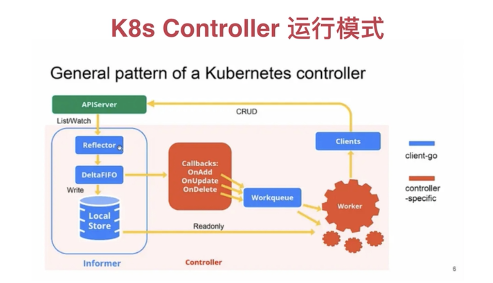
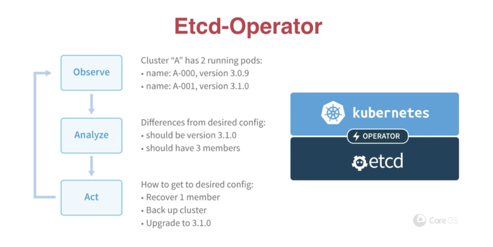
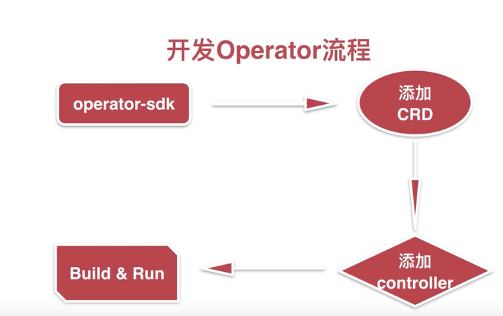

# Kubernetes 概念普及

## 内建资源类型

- K8S内建资源类型Service/Pod/Deployment等
- 通过Controller Manager 监听，对创建、删除、更新做出响应

### CRD

- Custom Resource Definition 自定义的K8S资源类型
- K8S通过APIServer，在etcd中注册一种新的资源类型，同实现Custom Controller 来监听资源的变化

## Operator

- 是一个感知应用状态的控制器

- CoreOS推出的旨在简化复杂的，有状态的应用管理框架

- 通过扩展kubernetes API来自动创建、管理和配置应用实例

### 原理

- Operator 基于Third Party Resources 扩展了新的应用资源

- 通过控制器来保证应用处于预期状态

- Operator 就是用CRD实现的定制化的Controller.它与K8S内奸的Controller遵循同样的运行模式

  

- 

### Etcd-Operator

- 通过KubernetesAPI 观察etcd集群的当前状态

- 分析当前状态与期望状态的差别

- 调用etcd集群管理的API或kubernetesAPI的API，满足状态

  

-  

## 安装operator-sdk

- git clone https://github.com/operator-framework/operator-sdk.git
- Make dep & make install
- MAC 电脑:brew install operator-sdk

## 安装docker registry

- `docker run -d -p 5000:5000 --restart always --name registry -v ~/docker-data/docker_registry:/var/lib/regsitry registry:2`

- "Insecure-registries":["mock.com:5000"]
- 查看镜像：http://mock.com:5000/v2/_catalog

# Operator 开发流程

## 开发operator 准备

- git clone https://github.com/kubernetes/kubernetes.git
- cp -R kubernetes/staging/src/k8s.io $GOPATH/src/k8s.io
- mkdir $GOPATH/src/sigs.k8s.io 在此目录下clone controller-runtime
- git clone https://github.com/kubernetes-sigs/controller-runtime

## operator sdk quick start

- operator-sdk new imoocpod-operator --skip-validation=true --repo=github.com/imooc-com/imoocpod-operator
- operator-sdk add api --api-version=k8s.imooc.com/v1alpha1 --kind=ImoocPod
- Operator-sdk add controller --api-version=k8s.imooc.com/v1alpha1 --kind=ImoocPod

### 开发controller

- 当*_type.go发生变化执行：operator-sdk generate k8s
- operator-sdk build rubinus/imoocpod-operator
- docker push rubinus/imoocpod-operator

### 部署operator

- kubectl apply -f deploy/service_account.yaml
- kubectl apply -f deploy/role.yaml
- kubectl apply -f deploy/role_binding.yaml
- kubectl apply -f deploy/operator.yaml

### 部署CRD和CR

- Kubectl apply -f deploy/crds/k8s.imooc.com_imoocpods_crd.yaml
- Kubectl apply -f deploy/crds/k8s.imooc.com_v1alpha1_imoocpod_cr.yaml

### etcd中的CRD

- kubectl -n kube-system exec etcd-docker-desktop --env "ETCDCTL_API=3" etcdctl --cacert=/etc/kubernetes/pki/etcd/ca.crt --cert=/etc/kubernetes/pki/etcd/healthcheck-client.crt --key=/etc/kubernetes/pki/etcd/healthcheck-client.key get /registry/apiextensions.k8s.io/customresourcedefinitions --prefix

