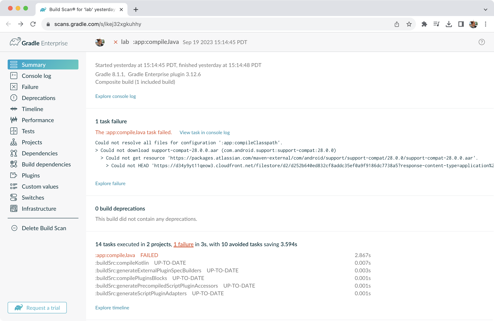
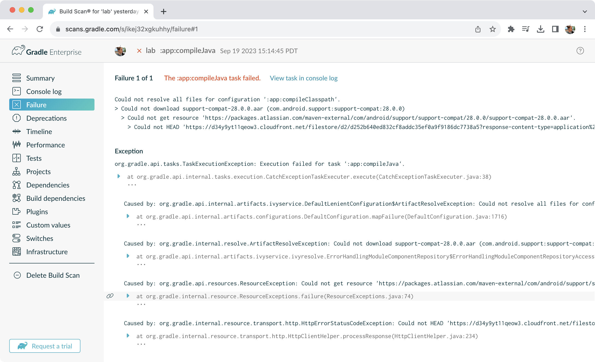

# 构建扫描
构建扫描是 捕获的元数据表示，当您运行构建时。


## 一、构建扫描
Gradle [捕获您的构建元数据](https://docs.gradle.org.cn/current/userguide/build_scans.html#sec:captured-information) 并将其发送到 [构建扫描服务](https://scans.gradle.com/)。然后，该服务将元数据转换为您可以分析并与他人共享的信息。




扫描收集的信息在对构建进行故障排除、协作或优化性能时可能是一种宝贵的资源。

例如，使用构建扫描，不再需要复制和粘贴错误消息或包括有关您的环境的所有详细信息，每次您想在 Stack Overflow、Slack 或 Gradle 论坛上提问时。 相反，复制指向您最新构建扫描的链接。



## 二、启用构建扫描
要在 gradle 命令上启用构建扫描，请将 --scan 添加到命令行选项

```bash
./gradlew build --scan
```
系统可能会提示您同意使用构建扫描的条款。

## 三、捕获异常

要查看在构建扫描中捕获和发送哪些数据，请参阅 Gradle Develocity 插件文档中的 [“捕获的信息”](https://docs.gradle.com/develocity/gradle-plugin/current/#captured_information)) 部分。