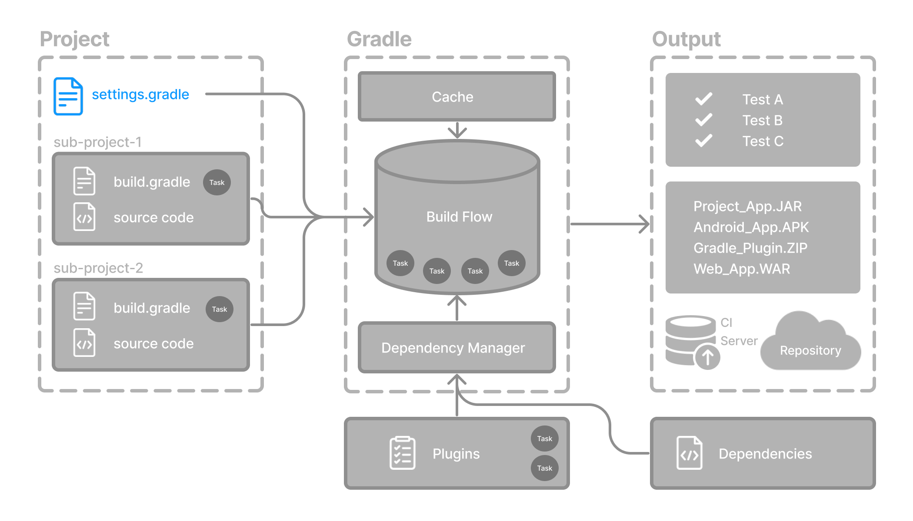

# 设置文件基础知识
设置文件是每个 Gradle 项目的入口点。



*设置文件的主要目的是向您的构建添加子项目。*

Gradle 支持单项目和多项目构建。

- 对于单项目构建，设置文件是可选的。
- 对于多项目构建，设置文件是强制性的，并且声明所有子项目。

## 设置脚本
设置文件是一个脚本。它可以是以 Groovy 编写的 settings.gradle 文件，也可以是以 Kotlin 编写的 settings.gradle.kts 文件。

[Groovy DSL](https://docs.gradle.org.cn/current/dsl/index.html) 和 [Kotlin DSL](https://docs.gradle.org.cn/current/kotlin-dsl/index.html) 是 Gradle 脚本唯一接受的语言。

设置文件通常位于项目的根目录中。

让我们看一个例子并分解它
> settings.gradle.kts 使用kotlin语法编写
```kotlin
rootProject.name = "root-project"   ① 

include("sub-project-a")            ②
include("sub-project-b")
include("sub-project-c")
```
> settings.gradle 使用groovy语法编写
```groovy
rootProject.name = 'root-project'   ① 

include('sub-project-a')            ②
include('sub-project-b')
include('sub-project-c')
```


① 定义项目名称。
② 添加子项目。

### 1.定义项目名称
设置文件定义您的项目名称
```
rootProject.name = "root-project"
```

每个构建只有一个根项目。


### 2.添加子项目
设置文件通过包含子项目（如果有）来定义项目的结构
```
include("app")
include("business-logic")
include("data-model")
```

