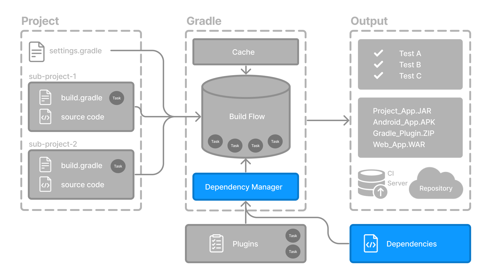

# 依赖管理基础
Gradle 内置了对 依赖管理 的支持。


依赖管理是一种自动化技术，用于声明和解析项目所需的外部资源。

Gradle 构建脚本定义了构建可能需要外部依赖的项目的过程。依赖是指支持构建项目的 JAR 包、插件、库或源代码。

### 一、版本目录

版本目录提供了一种在 libs.versions.toml 文件中集中声明依赖的方法。

该目录简化了子项目之间共享依赖和版本配置的过程。它还允许团队在大型项目中强制执行库和插件的版本。

版本目录通常包含四个部分

1. [versions] 用于声明插件和库将引用的版本号。
2. [libraries] 用于定义构建文件中使用的库。
3. [bundles] 用于定义一组依赖。
4. [plugins] 用于定义插件。

```toml
[versions]
androidGradlePlugin = "7.4.1"
mockito = "2.16.0"

[libraries]
googleMaterial = { group = "com.google.android.material", name = "material", version = "1.1.0-alpha05" }
mockitoCore = { module = "org.mockito:mockito-core", version.ref = "mockito" }

[plugins]
androidApplication = { id = "com.android.application", version.ref = "androidGradlePlugin" }

```

该文件位于 gradle 目录中，以便 Gradle 和 IDE 可以自动使用它。版本目录应签入源代码控制：gradle/libs.versions.toml。

### 声明依赖

要向您的项目添加依赖，请在 build.gradle(.kts) 文件的 dependencies 代码块中指定依赖。

以下 build.gradle.kts 文件使用上面的版本目录向项目添加一个插件和两个依赖

```kotlin
plugins {
   alias(libs.plugins.androidApplication)  ①
}

dependencies {
    // Dependency on a remote binary to compile and run the code
    implementation(libs.googleMaterial)    ②

    // Dependency on a remote binary to compile and run the test code
    testImplementation(libs.mockitoCore)   ③
}
```

① 将 Android Gradle 插件应用于此项目，该插件添加了几个特定于构建 Android 应用程序的功能。

② 将 Material 依赖添加到项目中。Material Design 提供了用于在 Android 应用程序中创建用户界面的组件。此库将用于编译和运行此项目中的 Kotlin 源代码。

③ 将 Mockito 依赖添加到项目中。Mockito 是一个用于测试 Java 代码的 Mocking 框架。此库将用于编译和运行此项目中的测试源代码。

Gradle 中的依赖按配置分组。

- material 库被添加到 implementation 配置中，该配置用于编译和运行生产代码。
- mockito-core 库被添加到 testImplementation 配置中，该配置用于编译和运行测试代码。

> 此处知识示例，还有更多配置可用

### 查看项目依赖

```
$ ./gradlew :app:dependencies
```

