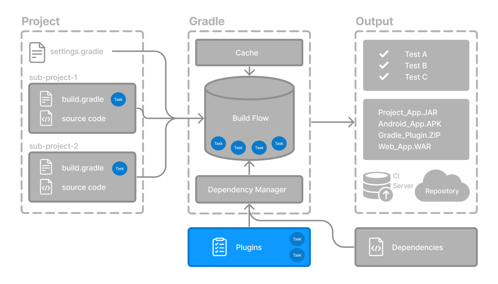

# Task 任务基础
任务表示构建执行的某些 独立工作单元，例如编译类、创建 JAR、生成 Javadoc 或将归档发布到仓库。


您可以使用 gradle 命令或通过在项目目录中调用 Gradle Wrapper (./gradlew 或 gradlew.bat) 来运行 Gradle build 任务
```
$ ./gradlew build
```

## 一、可用任务

项目中的所有可用任务都来自 Gradle 插件和构建脚本。

您可以通过在终端中运行以下命令来列出项目中的所有可用任务
```
$ ./gradlew tasks
```


## 二、运行任务

run 任务使用 ./gradlew run 执行
```
$ ./gradlew run
```

## 三、任务依赖
 
 很多时候，一个任务需要另一个任务先运行。

 例如，为了让 Gradle 执行 build 任务，必须首先编译 Java 代码。因此，build 任务依赖于 compileJava 任务。

 这意味着 compileJava 任务将在 build 任务之前运行

 ```
 $ ./gradlew build
 ```

构建脚本可以选择定义任务依赖关系。然后 Gradle 会自动确定任务执行顺序。