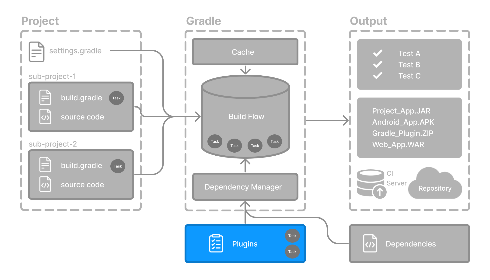

# 插件基础
Gradle 构建于插件系统之上。 Gradle 本身主要由基础设施组成，例如复杂的依赖项解析引擎。 其余功能来自插件。

插件是一段软件，为 Gradle 构建系统提供额外的功能。



插件可以应用于 Gradle 构建脚本，以添加新任务、配置或其他构建相关功能
### Java 库插件 - java-library
用于定义和构建 Java 库。 它使用 compileJava 任务编译 Java 源代码，使用 javadoc 任务生成 Javadoc，并使用 jar 任务将编译后的类打包到 JAR 文件中。
### Google Services Gradle 插件 - com.google.gms:google-services
通过名为 googleServices{} 的配置块和一个名为 generateReleaseAssets 的任务，在您的 Android 应用程序中启用 Google API 和 Firebase 服务。
### Gradle Bintray 插件 - com.jfrog.bintray
允许您通过使用 bintray{} 块配置插件来将工件发布到 Bintray。

## 一、插件分发
插件通过三种方式分发
1. 核心插件 - Gradle 开发并维护一组[核心插件](https://docs.gradle.org.cn/current/userguide/plugin_reference.html#plugin_reference)。
2. 社区插件 - Gradle 社区通过 [Gradle 插件门户](https://plugins.gradle.org/)共享插件。
3. 本地插件 - Gradle 允许用户使用 [API](https://docs.gradle.org.cn/current/javadoc/org/gradle/api/Plugin.html) 创建自定义插件。

## 二、应用插件
将插件应用到项目允许插件扩展项目的功能。

您可以使用插件 ID（全局唯一标识符/名称）和版本在构建脚本中应用插件
```
plugins {
    id «plugin id» version «plugin version»
}
```

### 2.1、核心插件
Gradle 核心插件是 Gradle 发行版本身包含的一组插件。 这些插件为构建和管理项目提供基本功能。

核心插件的一些示例包括
- java：提供对构建 Java 项目的支持。
- groovy：添加对编译和测试 Groovy 源文件的支持。
- ear：添加对为企业应用程序构建 EAR 文件的支持。

核心插件的独特之处在于，当在构建脚本中应用时，它们提供短名称，例如核心 [JavaPlugin](https://docs.gradle.org.cn/current/javadoc/org/gradle/api/plugins/JavaPlugin.html) 的 java。 它们也不需要版本。 要将 java 插件应用于项目

**build.gradle.kts**
```
plugins {
    id("java")
}
```

用户可以利用许多[Gradle 核心插件](https://docs.gradle.org.cn/current/userguide/plugin_reference.html#plugin_reference)。

### 2.2、社区插件

社区插件是由 Gradle 社区开发的插件，而不是核心 Gradle 发行版的一部分。 这些插件提供额外的功能，这些功能可能特定于某些用例或技术。

[Spring Boot Gradle 插件打](https://plugins.gradle.org/plugin/org.springframework.boot)包可执行 JAR 或 WAR 存档，并运行 [Spring Boot](https://springframework.org.cn/) Java 应用程序。

要将 org.springframework.boot 插件应用于项目

**build.gradle.kts**
```kotlin
plugins {
    id("org.springframework.boot") version "3.1.5"
}

```

社区插件可以发布在 [Gradle 插件门户](http://plugins.gradle.org/)上，其他 Gradle 用户可以在那里轻松发现和使用它们。

### 2.3、本地插件

自定义插件或本地插件是在特定项目或组织内开发和使用的插件。 这些插件不公开共享，并且是为项目或组织的特定需求量身定制的。

本地插件可以封装通用的构建逻辑，提供与内部系统或工具的集成，或将复杂的功能抽象为可重用的组件。

Gradle 为用户提供了使用 API 开发自定义插件的能力。 要创建您自己的插件，您通常需要执行以下步骤

**1.定义插件类：**创建一个新类，实现 Plugin<Project> 接口。
```Java
// Define a 'HelloPlugin' plugin
class HelloPlugin : Plugin<Project> {
    override fun apply(project: Project) {
        // Define the 'hello' task
        val helloTask = project.tasks.register("hello") {
            doLast {
                println("Hello, Gradle!")
            }
        }
    }
}
```
**2.构建并选择性地发布您的插件：**生成一个包含您的插件代码的 JAR 文件，并选择性地将此 JAR 发布到仓库（本地或远程），以便在其他项目中使用。
```groovy
// Publish the plugin
plugins {
    `maven-publish`
}

publishing {
    publications {
        create<MavenPublication>("mavenJava") {
            from(components["java"])
        }
    }
    repositories {
        mavenLocal()
    }
}
```

**3.应用您的插件：**当您想要使用插件时，请在构建文件的 plugins{} 块中包含插件 ID 和版本。
```groovy
// Apply the plugin
plugins {
    id("com.example.hello") version "1.0"
}
```
请查阅[插件开发章节](https://docs.gradle.org.cn/current/userguide/custom_plugins.html#custom_plugins)以了解更多信息。

