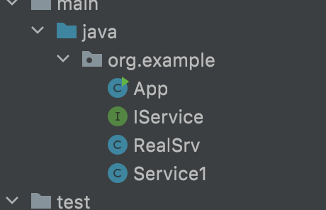
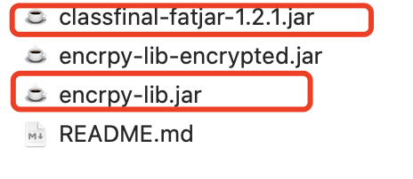
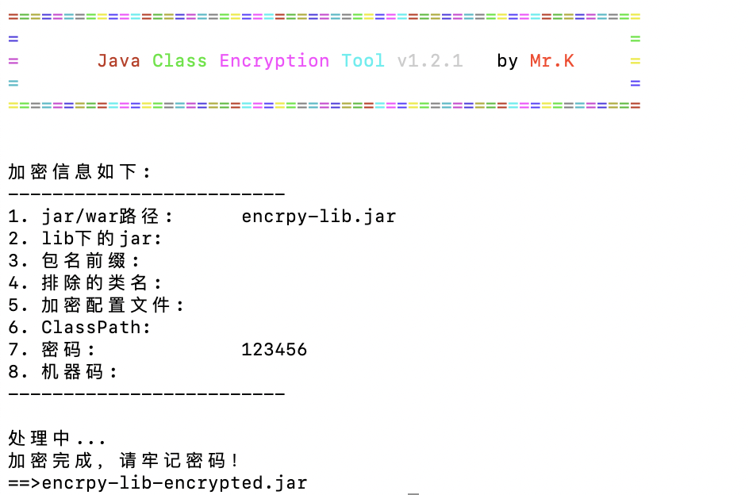
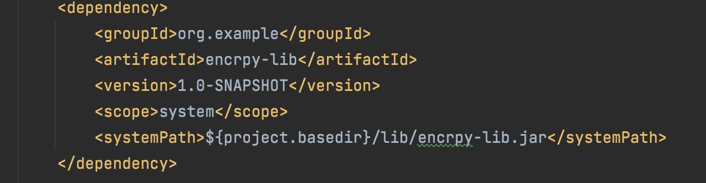
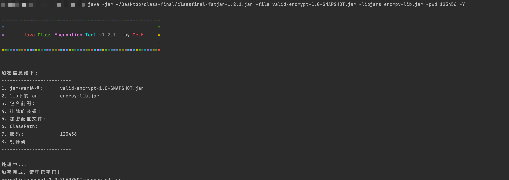
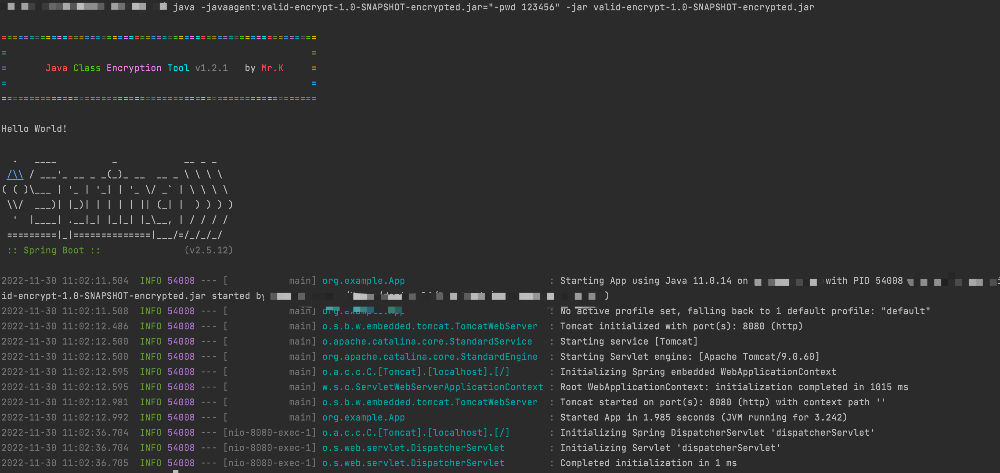
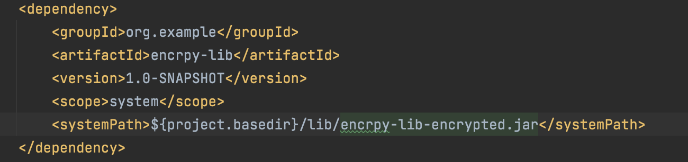

# Jar包机密混淆（2）
## ClassFinal 介绍
> 官方地址：https://gitee.com/roseboy/classfinal

详细介绍参考文档
## 准备Jar
新建一个被加密的Jar包

1. Service1 代码如下
    ```
    public class Service1 {
        public String srvName(){
            return "this is srv1";
        }
    }
    ```
2. IService 代码如下
    ```
    public interface IService {
        String realName();
    }
    ```
3. RealSrv 代码如下
    ```
    public class RealSrv implements IService{
        @Override
        public String realName() {
            return "this is real service";
        }
    }
    ```
打包为`encrpy-lib.jar`

## 放到classfinal-fatjar.jar目录下

执行命令：
```
java -jar classfinal-fatjar-1.2.1.jar -file encrpy-lib.jar -packages org.example -pwd 123456 -Y
```
> 不加-packages参数不会进行加密
输出结果：


## 验证可用性
> 新建验证项目

### 引用中使用未加密的文件进行加密
1. 项目中使用文件目录引用

2. 加密打好的包

3. 启动验证
执行命令
```
java -javaagent:valid-encrypt-1.0-SNAPSHOT-encrypted.jar="-pwd 123456" -jar valid-encrypt-1.0-SNAPSHOT-encrypted.jar
```


### 直接引用加密过后的包
1. 项目中使用文件目录引用

2. 不再对整体包进行加密

3. 启动验证
启动命令：
```
java -javaagent:../lib/common-lib-encrypted.jar="-pwd 123456" -jar valid-encrypt-1.0-SNAPSHOT.jar

```
