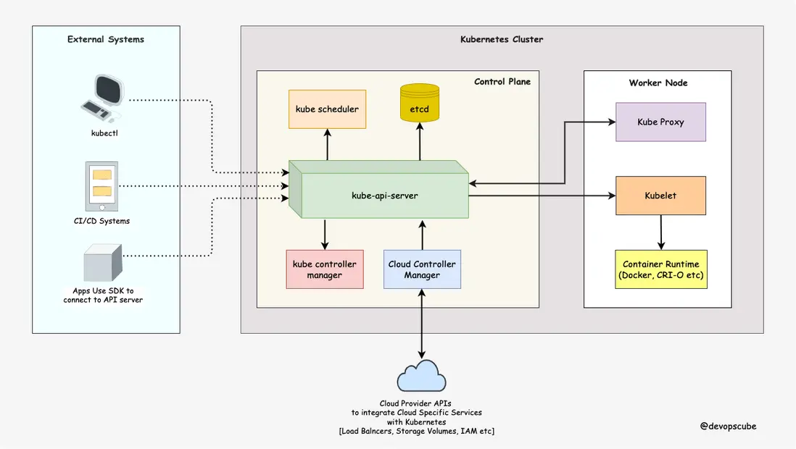
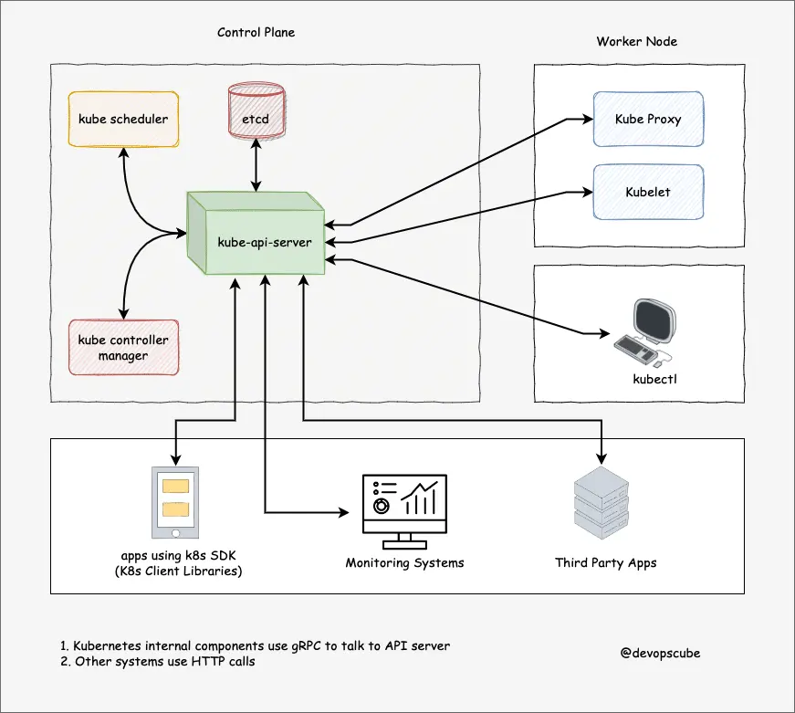
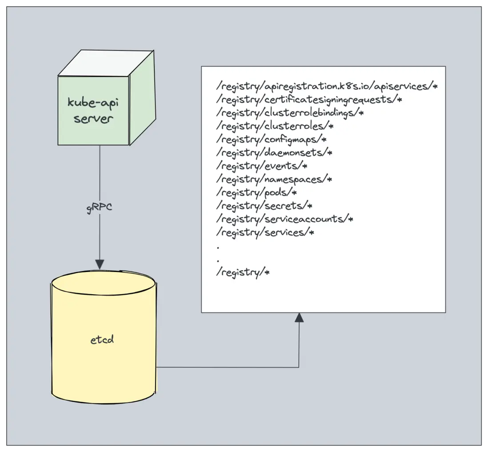
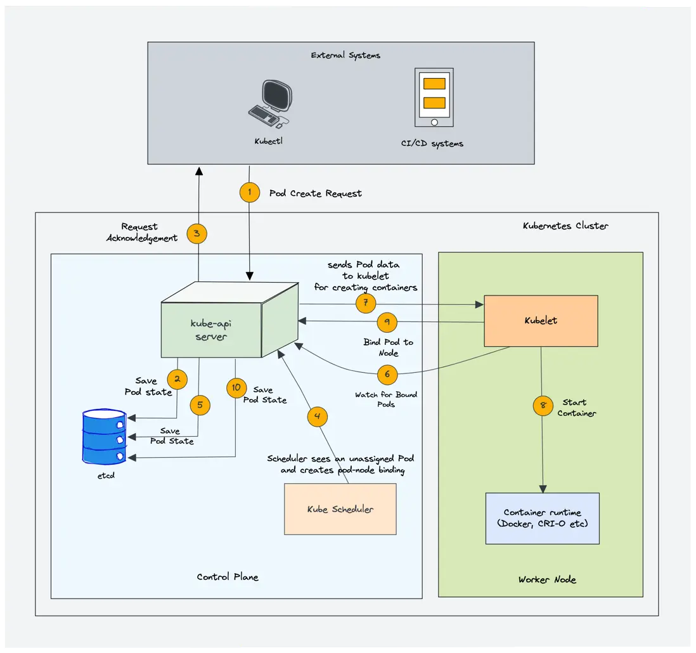
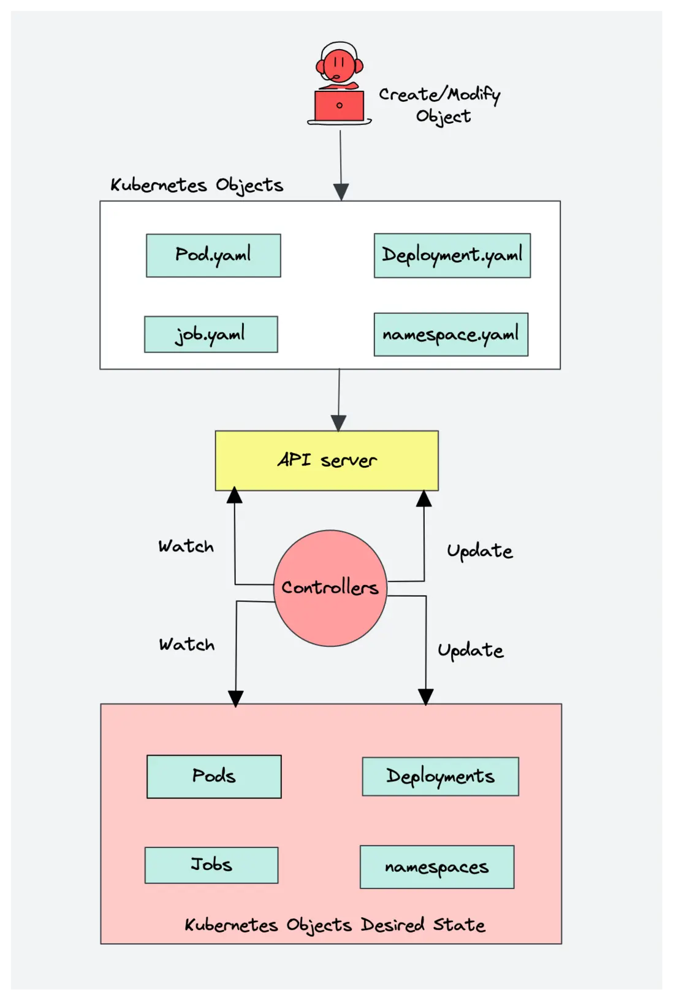
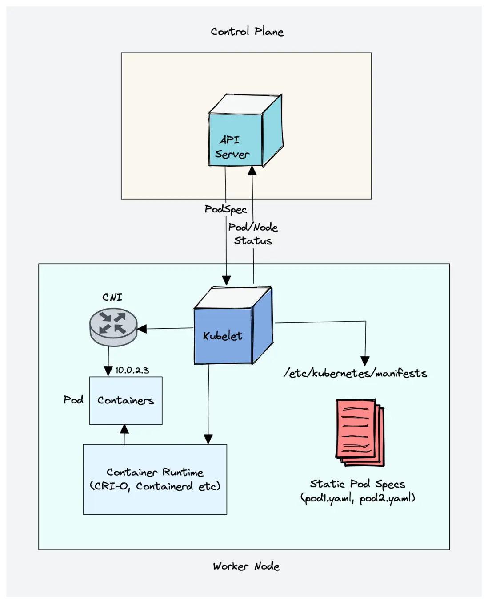
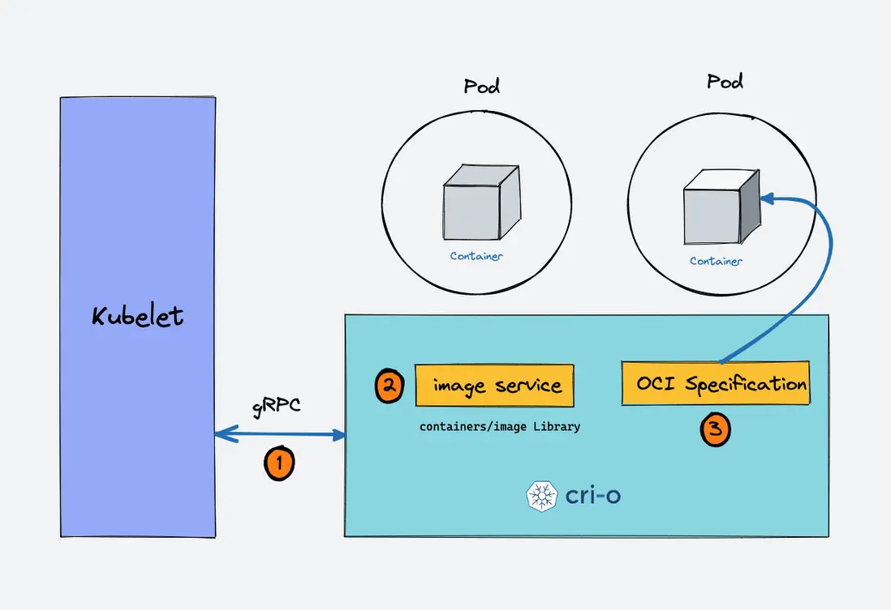
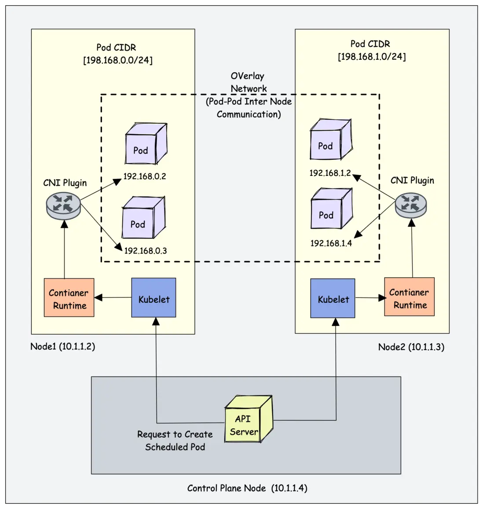

# 一、整体架构

> 首先需要俩接到kubernetes 是一个分布式系统，他的不同的组件分布在网络上的不同节点上。

从图中可以看出整个集群由控制面和工作节点组成。

## 1.1 控制面

控制平面负责容器编排和维护集群的所需状态。包含以下组件：
1. kube-apiserver
2. etcd
3. kube-scheduler
4. kube-controller-manager

一个集群可以有一个或多个控制平面节点。
## 1.2 工作节点

Worker 节点负责运行容器化应用程序。worker 节点具有以下组件：
1. kubelet
2. kube-proxy
3. Container runtime

# 二、Kubernetes 控制平面组件

## 2.1 apiserver

kube-apiserver 是公开 Kubernetes API 的 Kubernetes 集群的中心枢纽。它具有高度可扩展性，可以处理大量并发请求。最终用户和其他集群组件通过 API 服务器（kube-apiserver）与集群通信。在极少数情况下，监控系统和第三方服务可能会与 apiserver 通信以与集群进行交互。

当您使用 kubectl 管理集群时，在后端，您实际上是通过 HTTP REST API 与 API 服务器进行通信。但是，内部集群组件（如 scheduler、controller 等）使用 gRPC 与 API 服务器通信。

API 服务器与集群中的其他组件之间的通信通过 TLS 进行，以防止对集群进行未经授权的访问。

Kubernetes api-server 负责以下工作:
1. API 管理：公开集群 API endpoint 并处理所有 API 请求。API 是版本化的，它同时支持多个 API 版本。
2. 身份验证（使用客户端证书、持有者令牌和 HTTP 基本身份验证）和授权（ABAC 和 RBAC）
3. 处理 API 请求并验证 API 对象（如 Pod、服务等）的数据（验证和变更准入控制器）
4. 它是唯一与 etcd 通信的组件
5. api-server 协调控制平面和工作节点组件之间的所有进程
6. api-server 有一个内置的 apiserver 代理。它是 API 服务器进程的一部分。它主要用于启用从群集外部访问 ClusterIP 服务，即使这些服务通常只能在群集本身内访问
7. API 服务器还包含一个聚合层，允许您扩展 Kubernetes API 以创建自定义 API、资源和控制器
8. API 服务器还支持监视资源的更改。例如，客户端可以对特定资源建立监视，并在创建、修改或删除这些资源时接收实时通知

## 2.2 Etcd

Kubernetes 是一个分布式系统，它需要一个高效的分布式数据库，如 etcd 来支持其分布式性质。它既充当后端服务发现，又充当数据库。你可以称它为 Kubernetes 集群的大脑。

etcd 是一个开源的强一致性分布式键值存储。那么这意味着什么呢？
1. 强一致性：如果对某个节点进行了更新，则强一致性将确保它立即更新到群集中的所有其他节点。此外，如果你看一下CAP定理，就不可能实现100%的可用性，并具有很强的一致性和分区容错
2. 分布式：etcd 被设计为在不牺牲一致性的情况下作为集群在多个节点上运行
3. 键值存储：将数据存储为键和值的非关系数据库。它还公开键值 API。数据存储建立在 BboltDB 之上，BboltDB 是 BoltDB 的一个分支

etcd 使用 raft 共识算法，具有很强的一致性和可用性。它以领导者成员的方式工作，以实现高可用性并承受节点故障。

那么 etcd 是如何与 Kubernetes 一起工作的呢？

简单地说，当你使用 kubectl 获取 kubernetes 对象详细信息时，你是从 etcd 获取的。此外，当您部署像 pod 这样的对象时，会在 etcd 中创建一个条目。

简而言之，有关 etcd 的信息如下：
1. etcd 存储 Kubernetes 对象的所有配置、状态和元数据（pod、secret、daemonsets、deployments、configmaps、statefulsets 等）。
2. etcd 允许客户端使用 Watch() API 订阅事件。Kubernetes api-server 使用 etcd 的监视功能来跟踪对象状态的变化。
3. etcd 使用 gRPC 公开键值 API。此外，gRPC 网关是一个 RESTful 代理，可将所有 HTTP API 调用转换为 gRPC 消息。这使它成为 Kubernetes 的理想数据库。
4. etcd 以键值格式存储所有对象，在 /registry 目录项下。例如，可以在 /registry/pods/default/nginx 下找到默认命名空间中名为 Nginx 的 Pod 的信息

> etcd 是控制平面中唯一的 Statefulset 组件。

## 2.3 kube-scheduler

kube-scheduler 负责在工作节点上调度 Kubernetes Pod。

部署容器时，您可以指定容器要求，例如 CPU、内存、关联性、污点或容错、优先级、持久卷 （PV） 等。调度程序的主要任务是识别创建请求，并为满足要求的 Pod 选择最佳节点。

下图显示了调度程序工作原理的概述。

在 Kubernetes 集群中，将有多个工作节点。那么调度程序是如何从所有工作节点中选择节点的呢？以下是调度程序的工作原理。
1. 为了选择最佳节点，Kube-scheduler 使用过滤和评分操作。
2. 在筛选中，调度程序会找到最适合调度 Pod 的节点。例如，如果有 5 个节点有充足资源来运行 Pod，则它会选择所有 5 个节点。如果没有节点，则 Pod 不可调度并移动到调度队列。如果它是一个大型集群，假设有 100 个工作节点，这种情况下调度程序不会遍历所有节点，会根据percentageOfNodesToScore 参数的设置进行遍历。percentageOfNodesToScore 的调度器配置参数，默认值通常为 50%，此时会试图以循环方式迭代超过 50% 的节点。如果工作器节点分布在多个区域中，则调度程序将遍历不同区域中的节点。对于非常大的集群，默认 percentageOfNodesToScore 值为 5%。
3. 在评分阶段，调度程序通过向筛选的工作器节点分配分数来对节点进行排名。调度程序通过调用多个调度插件进行评分。最后，将选择排名最高的 worker 节点来调度 pod。如果所有节点的排名相同，则将随机选择一个节点。
4. 选择节点后，调度程序将在 API 服务器中创建绑定事件。表示绑定 Pod 和节点的事件。

有关调度程序，还要关注：

1. 它是一个控制器，用于侦听 API 服务器中的 Pod 创建事件。
2. 调度程序有两个阶段。调度周期和绑定周期。统称为调度上下文。调度周期选择工作器节点，绑定周期将该更改应用于集群。
3. 调度程序始终将高优先级的 Pod 放在低优先级的 Pod 之前进行调度。此外，在某些情况下，在 Pod 开始在所选节点中运行后，Pod 可能会被逐出或移动到其他节点。如果您想了解更多信息，请阅读 Kubernetes Pod 优先级指南
4. 您可以创建自定义调度程序，并在集群中运行多个调度程序以及原生调度程序。部署 Pod 时，您可以在 Pod 清单中指定自定义调度程序。因此，调度决策将基于自定义调度程序逻辑进行。
5. 调度程序具有可插拔的调度框架。这意味着，您可以将自定义插件添加到调度工作流程中。

## 2.4 kube-controller-manager

什么是控制器？控制器是运行无限控制循环的程序。这意味着它连续运行并监视对象的实际和所需状态。如果实际状态和期望状态存在差异，则确保 kubernetes 资源/对象处于期望状态。

官方描述如下：
> 在 Kubernetes 中，控制器是监视集群状态的控制循环，然后在需要时进行更改或请求更改。每个控制器都尝试将当前集群状态移近所需状态。

假设要创建部署，在清单 YAML 文件中指定所需的状态（声明性方法）。例如，2 个副本、1 个卷挂载、configmap 等。内置的部署控制器可确保部署始终处于所需状态。如果用户使用 5 个副本更新部署，则部署控制器会识别它并确保所需的状态为 5 个副本。

Kube Controller Manager 是管理所有 Kubernetes 控制器的组件。Kubernetes 资源/对象（如 Pod、命名空间、作业、副本集）由各自的控制器管理。此外，Kube-Scheduler 也是一个由 Kube-Controller-Manager 管理的控制器。

Kubernetes 重要的内置控制器有：
- Deployment controller
- ReplicaSet controller
- DaemonSet controller
- Job controller
- CronJob controller
- endpoints controller
- namespace controller
- service account controller
- Node controller

此外还需要关注Kube Controller Manager的信息如下：
1. 它管理所有控制器，控制器尝试将集群保持在所需状态。
2. 您可以使用与自定义资源定义关联的自定义控制器来扩展 kubernetes。

# 三、Kubernetes 工作节点组件

## 3.1 kubelet

Kubelet 是一个 Agent 组件，运行在集群中的每个节点上。Kubelet 不作为容器运行，而是作为守护程序运行，由 systemd 管理。

它负责向 API 服务器注册工作节点，并主要从 API 服务器使用 podSpec（Pod 规范 – YAML 或 JSON）。然后，它通过创建容器将 podSpec 带到所需状态。

> podSpec 定义了应在 Pod 内运行的容器、它们的资源（例如 CPU 和内存限制）以及其他设置，例如环境变量、卷和标签。

Kubelet 负责以下工作:

1. 创建、修改和删除容器。
2. 负责处理活跃度、准备情况和启动探测。
3. 负责通过读取 Pod 配置并在主机上为卷挂载创建相应的目录来挂载卷。
4. 通过调用 API 服务器来收集和报告节点和 Pod 状态 ，实现方式为 cAdvisor 和 CRI。

Kubelet 也是一个控制器，它监视 Pod 的变化，并利用节点的容器运行时来拉取镜像、运行容器等。

除了来自 API 服务器的 PodSpec 之外，Kubelet 还可以接受来自文件、HTTP 端点和 HTTP 服务器的 podSpec。“来自文件的 podSpec”的一个很好的例子是 Kubernetes 静态 pod。

静态 Pod 由 Kubelet 控制，而不是由 API 服务器控制。这意味着您可以通过向 Kubelet 组件提供 Pod YAML 位置来创建 Pod。但是，Kubelet 创建的静态 Pod 不受 API 服务器的管理。下面是静态 Pod 的真实示例用例。

在启动控制平面各组件时，kubelet 从 /etc/kubernetes/manifests 读取 podSpecs，启动 api-server、scheduler 和 controller-manager 作为静态 pod。

kubelet 的关键内容如下：

1. Kubelet 使用 CRI（容器运行时接口）gRPC 接口与容器运行时通信。
2. 它还公开 HTTP 终结点以流式传输日志，并为客户端提供 exec 会话。
3. 使用 CSI（容器存储接口）gRPC 配置块存储卷。
4. 它使用集群中配置的 CNI 插件来分配 Pod IP 地址，并为 Pod 设置任何必要的网络路由和防火墙规则。

## 3.2 kube-proxy

 Kube proxy需要提前对 Kubernetes 服务和端点对象有基本的了解。

Kubernetes 中的服务是一种在内部或向外部流量公开一组 Pod 的方法。创建服务对象时，它会为其分配一个虚拟 IP。它被称为 clusterIP。它只能在 Kubernetes 集群中访问。

Endpoint 对象包含 Service 对象下 Pod 组的所有 IP 地址和端口。端点控制器负责维护容器 IP 地址（端点）列表。服务控制器负责为服务配置端点。

 ClusterIP 是无法 ping 的 ，因为它仅用于服务发现，这与可 ping 的 Pod IP 不同。

接下来，我们了解Kube Proxy。

Kube proxy 与 API 服务器通信，以获取有关服务 （ClusterIP） 和相应 Pod IP 和端口（端点）的详细信息。并监视服务和端点的更改。

kube-proxy 使用以下任一模式创建/更新规则，将流量路由到 Service 后面的 Pod：

1. IPTables：这是默认模式。在 IPTables 模式量由 IPtable 规则处理。这意味着，对于每个服务，都会创建 IPtable 规则。这些规则捕获进入 ClusterIP 的流量，然后将其转发到后端 Pod。此外，在这种模式下，kube-proxy 会随机选择后端 pod 进行负载均衡。建立连接后，请求将转到同一 Pod，直到连接终止。
2. IPVS：对于服务超过 1000 的集群，IPVS 提供性能改进。它支持以下后端负载均衡算法。
    1. rr ：这是默认模式。
    2. lc ：最少连接数（最小打开连接数）
    3. dh ：目标哈希
    4. sh ：源哈希
    5. sed ：最短的预期延迟
    6. nq ：从不排队
3. Userspace：用户空间（旧版和不推荐）
4. Kernelspace：此模式仅适用于 Windows 系统。

如果您想了解 kube-proxy IPtables 和 IPVS 模式之间的性能差异，请[阅读本文](https://www.tigera.io/blog/comparing-kube-proxy-modes-iptables-or-ipvs/)。

此外，您可以通过将 Kubernetes 集群替换为 Cilium 来运行没有 kube-proxy 的 Kubernetes 集群。
> 1.29 Alpha 功能：Kubeproxy 有一个基于 nftables 的新后端。nftables 是 IPtables 的继任者，旨在更简单、更高效

## 3.3 Container Runtime

您可能了解 Java 运行时 （JRE）。它是在主机上运行 Java 程序所需的软件。同样，容器运行时是运行容器所需的软件组件。

容器运行时在 Kubernetes 集群中的所有节点上运行。它负责从容器注册表中提取镜像、运行容器、分配和隔离容器资源，以及管理主机上容器的整个生命周期。

为了更好地理解这一点，让我们看一下两个关键概念：

1. 容器运行时接口 （CRI）：它是一组 API，允许 Kubernetes 与不同的容器运行时进行交互。它允许不同的容器运行时与 Kubernetes 互换使用。CRI 定义了用于创建、启动、停止和删除容器以及管理映像和容器网络的 API。
2. 开放容器倡议 （OCI）：它是一组容器格式和运行时的标准。

Kubernetes 支持多个符合容器运行时接口 （CRI） 的容器运行时（CRI-O、Docker Engine、containerd 等）。这意味着，所有这些容器运行时都实现了 CRI 接口，并公开了 gRPC CRI API（运行时和镜像服务端点）。

那么 Kubernetes 是如何利用容器运行时的呢？

正如我们在 Kubelet 部分所了解的，kubelet 代理负责使用 CRI API 与容器运行时进行交互，以管理容器的生命周期。它还从容器运行时获取所有容器信息，并将其提供给控制平面。

我们以 CRI-O 容器运行时接口为例。下面是容器运行时如何与 Kubernetes 配合使用的高级概述。

1. 当 API 服务器对 Pod 有新的请求时，kubelet 会与 CRI-O 守护进程通信，以通过 Kubernetes 容器运行时接口启动所需的容器。
2. CRI-O 使用 containers/image 库检查并从配置的容器注册表中提取所需的容器映像。
3. 然后，CRI-O 为容器生成 OCI 运行时规范 （JSON）。
4. 然后，CRI-O 启动与 OCI 兼容的运行时 （runc） 以根据运行时规范启动容器进程。

# 四、Kubernetes 集群插件组件

除了核心组件之外，kubernetes 集群还需要附加组件才能完全运行。选择插件取决于项目要求和应用场景。

以下是集群上可能需要的一些常用插件组件。

1. CNI 插件（容器网络接口）
2. CoreDNS（用于 DNS 服务）：CoreDNS 充当 Kubernetes 集群中的 DNS 服务器。通过启用此插件，您可以启用基于 DNS 的服务发现。
3. Metrics Server（用于资源指标）：此插件可帮助您收集集群中节点和 Pod 的性能数据和资源使用情况。
4. Web UI（Kubernetes 仪表板）：此插件使 Kubernetes 仪表板能够通过 Web UI 管理对象。

## 4.1 CNI Plugin

首先，您需要了解容器网络接口 （CNI）。它是一个基于插件的架构，具有供应商中立的规范和库，用于为容器创建网络接口。它不是特定于 Kubernetes 的。借助 CNI，容器网络可以在 Kubernetes、Mesos、CloudFoundry、Podman、Docker 等容器编排工具之间实现标准化。

在容器网络方面，公司可能有不同的要求，例如网络隔离、安全性、加密等。随着容器技术的进步，许多网络提供商为具有广泛网络功能的容器创建了基于 CNI 的解决方案。你可以称它为CNI-Plugins。

这允许用户从不同的提供商处选择最适合其需求的网络解决方案。

CNI 插件如何与 Kubernetes 配合使用？

1. Kube-controller-manager 负责为每个节点分配 Pod 网段。每个 Pod 从 Pod CIDR 获取一个唯一的 IP 地址。
2. Kubelet 与容器运行时交互以启动定时 Pod。作为容器运行时一部分的 CRI 插件与 CNI 插件交互以配置 Pod 网络。
3. CNI 插件支持使用叠加网络在分布在相同或不同节点上的 Pod 之间联网。

以下是 CNI 插件提供的高级功能。

1. Pod 网络
2. Pod 网络安全和隔离，使用网络策略来控制 Pod 之间和命名空间之间的流量。

一些流行的 CNI 插件包括：

- Calico
- Flannel
- Weave Net
- Cilium(Uses eBPF)
- Amazon VPC CNI (For AWS VPC)
- Azure CNI

# 五、kubernetes 原生对象

到目前为止，我们已经了解了核心 kubernetes 组件以及每个组件的工作原理。所有这些组件都致力于管理以下关键 Kubernetes 对象。

- Pod
- Namespace
- Replicaset
- Deployment
- Daemonset
- Statefulset
- Jobs & Cronjobs
- ConfigMaps & Secrets

在网络方面，以下 Kubernetes 对象起着关键作用。

- Service
- Ingress
- NetworkPolicy

此外，Kubernetes 可以使用 CRD 和自定义控制器进行扩展。因此，群集组件还管理使用自定义控制器和自定义资源定义创建的对象。

# 参考

https://segmentfault.com/a/1190000045077354