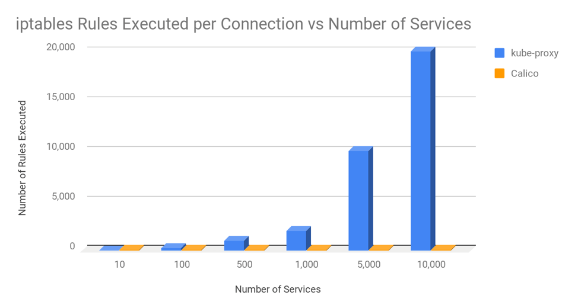

# [翻译]kube-proxy的IPTables 和 IPVS 模式对比

kube-proxy 是任何 Kubernetes 部署的关键组件。其作用是将发往服务的流量（通过集群 IP 和节点端口）负载平衡到正确的后端 Pod。Kube-proxy 可以在三种模式之一下运行，每种模式都使用不同的数据平面技术实现： 用户空间、  iptables或 IPVS。

用户空间模式非常老旧、速度慢，绝对不推荐！但是，您应该如何权衡是使用 iptables 还是 IPVS 模式？在本文中，我们将比较这两者，衡量它们在真实微服务环境中的性能，并解释何时您可能想要选择其中一种而不是另一种。

首先，我们将先了解一下这两种模式的背景，然后深入研究下面的测试和结果……

## 背景：iptables 代理模式
iptables 是一项 Linux 内核功能，旨在成为一种高效的防火墙，具有足够的灵活性来处理各种常见的数据包操作和过滤需求。它允许将灵活的规则序列附加到内核数据包处理管道中的各种挂钩。在 iptables 模式下，kube-proxy 将规则附加到“NAT 预路由”挂钩以实现其 NAT 和负载平衡功能。这很有效，很简单，它使用成熟的内核功能，并且它与其他也使用 iptables 进行过滤的程序（如 Calico！）“配合良好”。

但是，kube-proxy 编写 iptables 规则的方式意味着它名义上是一种 O（n）风格算法，其中 n 大致与集群大小成比例增长（或者更准确地说是服务数量和每个服务背后的后端 pod 数量）。

## 背景：IPVS 代理模式
IPVS 是专为负载平衡而设计的 Linux 内核功能。在 IPVS 模式下，kube-proxy 会编程 IPVS 负载平衡器，而不是使用 iptables。这种方法很有效，它还使用了成熟的内核功能，并且 IPVS 专 为平衡大量服务而设计 ；它具有优化的 API 和优化的查找例程，而不是连续规则列表。

结果是，kube-proxy 在 IPVS 模式下的连接处理具有名义上的 O(1) 计算复杂度。换句话说，在大多数情况下，其连接处理性能将保持不变，与集群大小无关。

此外，作为专用的负载均衡器，IPVS 拥有多种不同的调度算法，例如循环、最短预期延迟、最少连接和各种哈希方法。相比之下，iptables 中的 kube-proxy 使用随机等价选择算法。

IPVS 的一个潜在缺点是，IPVS 处理的数据包通过 iptables 过滤器钩子的路径与正常情况下的数据包非常不同。如果您计划将 IPVS 与其他使用 iptables 的程序一起使用，则需要研究它们是否会按预期运行。（不过不用担心，Calico 早就与 IPVS kube-proxy 兼容了！）

## 性能比较
好的，名义上，kube-proxy 在 iptables 模式下的连接处理为 O(n)，在 IPVS 模式下的连接处理为 O(1)。但在微服务执行真正的微服务类任务的背景下，这在现实中意味着什么？

在大多数情况下，当谈到应用程序和微服务环境中的 kube-proxy 性能时，您可能会关心两个关键属性：

1. 对往返响应时间的影响。  当一个微服务对另一个微服务进行 API 调用时，第一个微服务平均需要多长时间才能将请求发送到第二个微服务并从第二个微服务接收响应？
2. 对总 CPU 使用率的影响。  在运行微服务时，主机的总 CPU 使用率是多少（包括用户空间和内核/系统使用率），以及支持微服务（包括 kube-proxy）所需的所有进程？

为了说明这一点，我们在专用节点上运行了一个“客户端”微服务 pod，每秒向 Kubernetes 服务生成 1,000 个请求，该服务由集群中其他节点上运行的 10 个“服务器”微服务 pod 提供支持。然后，我们在 iptables 和 IPVS 模式下测量了客户端节点上的性能，其中有不同数量的 Kubernetes 服务，每个服务由 10 个 pod 支持，最多有 10,000 个服务（具有 100,000 个服务后端）。对于微服务，我们使用了一个用 golang 编写的简单测试工具作为客户端微服务，并使用标准 NGINX 作为服务器微服务的后端 pod。

### 往返响应时间
在考虑往返响应时间时，了解连接和请求之间的区别非常重要。通常，大多数微服务将使用持久或“keepalive”连接，这意味着每个连接在多个请求中重复使用，而不是每个请求都需要一个新连接。这很重要，因为大多数新连接都需要通过网络进行三次 TCP 握手（这需要时间），Linux 网络堆栈中的处理也更多（这需要更多时间和 CPU）。

为了说明这些差异，我们在有和没有保持连接的情况下进行了测试。对于保持连接，我们使用了 NGINX 的默认配置，该配置使每个连接保持活动状态，最多可重复使用 100 个请求。请参见下图，并注意响应时间越短越好。

该图表显示了两个关键事项：
- 在服务数量超过 1,000 个（后端 pod 数量为 10,000 个）之前，iptables 和 IPVS 之间的平均往返响应时间差异并不显著。
- 仅当不使用保持活动连接时，平均往返响应时间的差异才是可辨别的，即，当对每个请求都使用新连接时。

对于 iptables 和 IPVS 模式，kube-proxy 的响应时间开销与建立连接有关，而不是与您在这些连接上发送的数据包或请求的数量有关。这是因为 Linux 使用连接跟踪 (conntrack)，它能够非常有效地将数据包与现有连接进行匹配。如果数据包在 conntrack 中匹配，则无需通过 kube-proxy 的 iptables 或 IPVS 规则来确定如何处理它。Linux conntrack 是您的朋友！  （几乎所有时间......请留意我们的下一篇博客文章“当 Linux conntrack 不是您的朋友时”！）

值得注意的是，对于本例中的“服务器”微服务，我们使用 NGINX pod 来提供小型静态响应主体。许多微服务需要做的工作远不止这些，因此响应时间会相应增加，这意味着与此图表相比，kube-proxy 处理的增量占响应时间的百分比会更小。

最后还要解释一个奇怪的现象：如果 IPVS 中新连接的处理复杂度为 O(1)，那么为什么在有 10,000 个服务的情况下，IPVS 的非保持连接响应时间会变慢？我们需要做更多的挖掘才能真正弄清这个问题的根源，但其中一个因素是，由于主机 CPU 使用率的增加，整个系统的速度变慢了。这很好地引出了下一个话题。

### CPU 总容量
为了说明总体 CPU 使用率，下图重点关注不使用持久/保持活动连接的最坏情况，其中 kube-proxy 连接处理开销影响最大。

该图表显示了两个关键事项：

- iptables 和 IPVS 之间的 CPU 使用率差异相对较小，直到服务数量超过 1,000 个（后端 pod 数量为 10,000 个）。
- 在 10,000 个服务（带有 100,000 个后端 pod）时，使用 iptables 时 CPU 增加量约为核心的 35%，而使用 IPVS 时 CPU 增加量约为核心的 8%。

有两个主要因素影响这种 CPU 使用模式。

第一个因素是，默认情况下，kube-proxy 会以 30 秒为间隔对所有服务重新编程内核。这解释了为什么 IPVS 模式的 CPU 会略有增加，尽管 IPVS 处理新连接的复杂度名义上是 O(1)。此外，旧内核版本中用于重新编程 iptables 的 API 比现在慢得多。因此，如果您在 iptables 模式下使用带有 kube-proxy 的旧内核，您会看到比此图表更高的 CPU 增长。

第二个因素是 kube-proxy 使用 iptables 或 IPVS 处理新连接所需的时间。对于 iptables，这名义上是 O(n)。在大量服务中，这会显著增加 CPU 使用率。例如，在 10,000 个服务（具有 100,000 个后端 pod）中，iptables 为每个新连接执行约 20,000 条规则。但请记住，在此图表中，我们展示的是微服务的最坏情况，即每个请求都使用一个新连接。如果我们使用 NGINX 默认的 keepalive 即每个连接 100 个请求，那么 kube-proxy 的 iptables 规则的执行频率就会减少 100 倍，从而大大降低了使用 iptables 而不是 IPVS 对 CPU 的影响，使其接近核心的 2%。

值得注意的是，本例中使用的“客户端”微服务只是丢弃了从“服务器”微服务收到的每个响应。真正的微服务需要做的工作远不止这些，这会增加此图表中的基本 CPU 使用率，但不会改变与服务数量相关的 CPU 绝对增长。

## 结论
当服务规模远远超过 1,000 个时，kube-proxy 的 IPVS 模式可以提供一些不错的性能改进。您的里程可能会有所不同，但作为一般指南，对于使用持久“keepalive”式连接并在现代内核上运行的微服务，好处可能相对适中。对于不使用持久连接或在较旧内核上运行的微服务，将 kube-proxy 切换到 IPVS 模式可能会是一个不错的选择。 

除了性能考虑之外，如果您需要比 kube-proxy 的 iptables 模式随机负载平衡更复杂的负载平衡调度算法，您还应该考虑使用 IPVS 模式。

如果您不确定 IPVS 是否适合您，那么请坚持使用 iptables 模式下的 kube-proxy。它拥有大量生产强化功能，虽然它并不完美，但您可以说它是默认设置是有原因的。

## 后记：比较 kube-proxy 和 Calico 对 iptables 的使用

在本文中，我们了解了 kube-proxy 对 iptables 的使用如何在非常大规模的情况下导致性能影响。有时我会被问到为什么 Calico 没有遇到同样的挑战。答案是 Calico 对 iptables 的使用与 kube-proxy 有很大不同。Kube-proxy 使用非常长的规则链，其增长速度大致与集群大小成正比，而 Calico 使用非常短的优化规则链，并大量使用 ipset，其查找时间与大小无关，均为 O(1)。 

为了更清楚地说明这一点，下图显示了 kube-proxy 与 Calico 每个连接执行的 iptables 规则的平均数量，假设集群中的节点平均托管 30 个 pod，并且集群中的每个 pod 平均有 3 个适用于它的网络策略。

即使在具有 10,000 个服务和 100,000 个后端 pod 的完全扩展集群中运行，Calico 每个连接执行的 iptables 规则数量也仅与 kube-proxy 在 20 个服务和 200 个后端 pod 上执行的 iptables 规则数量大致相同。换句话说，Calico 对 iptables 的使用是可扩展的！

## 原文
https://www.tigera.io/blog/comparing-kube-proxy-modes-iptables-or-ipvs/