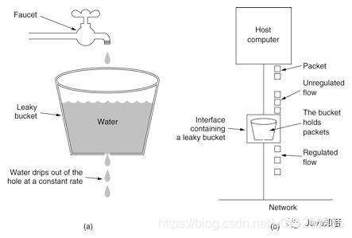
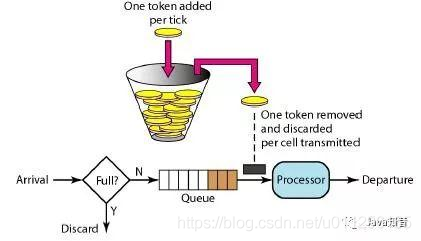

# 限流
> https://blog.csdn.net/u011296165/article/details/107761489

## 算法理论
### 漏桶算法
漏桶算法思路很简单，水（也就是请求）先进入到漏桶里，漏桶以一定的速度出水，当水流入速度过大会直接溢出，然后就拒绝请求，可以看出漏桶算法能强行限制数据的传输速率。示意图（来源网络）如下：

微服务架构下的分布式限流方案全解析


### 令牌桶算法
令牌桶算法和漏桶算法效果一样但方向相反的算法，更加容易理解。随着时间流逝，系统会按恒定1/QPS时间间隔（如果QPS=100，则间隔是10ms）往桶里加入令牌（想象和漏洞漏水相反，有个水龙头在不断的加水），如果桶已经满了就不再加了。新请求来临时，会各自拿走一个令牌，如果没有令牌可拿了就阻塞或者拒绝服务。示意图（来源网络）如下：

微服务架构下的分布式限流方案全解析
 

 ### 算法的选择
 漏桶算法与令牌桶算法的区别在于，漏桶算法能够强行限制数据的传输速率，令牌桶算法能够在限制数据的平均传输速率的同时还允许某种程度的突发情况。令牌桶还有一个好处是可以方便的改变速度。一旦需要提高速率，则按需提高放入桶中的令牌的速率。所以，限流框架的核心算法还是以令牌桶算法为主。

 ## 本地限流
 已知上面讲述的令牌桶算法的原理，如何通过代码实现？

本地限流的实现可以用Long长整型作为令牌桶，为了达到无锁，建议使用Long的原子类型AtomicLong，使用AtomicLong的好处就是可以非常方便的对其进行CAS加操作与CAS减操作（也就是令牌桶令牌的放入与拿取），以避免线程的上下文切换的开销，核心CAS算法如下：
```
private boolean tryAcquireFailed() {
   long l = bucket.longValue();
   while (l > 0) {
      if (bucket.compareAndSet(l, l - 1)) {
          return true;
      }
      l = bucket.longValue();
   }
   return false;
}
 
```
根据上述了解的令牌桶算法可以得知，令牌桶需要一个ScheduledThread不断的放入令牌，这部分的代码如下：
```
ScheduledThreadExecutor.scheduleAtFixedRate(() -> 
    bucket.set(rule.getLimit()), rule.getInitialDelay(), rule.getPeriod(), rule.getUnit()
);

```

## 分布式限流概述
分布式限流需要解决什么问题呢？我想至少有下面几个：

1.动态规则：比如限流的QPS我们希望可以动态修改，限流的功能可以随时开启、关闭，限流的规则可以跟随业务进行动态变更等。

2.集群限流：比如对Spring Cloud微服务架构中的某服务下的所有实例进行统一限流，以控制后续访问数据库的流量。

3.熔断降级：比如在调用链路中某个资源出现不稳定状态时（例如调用超时或异常比例升高），对这个资源的调用进行限制，让请求快速失败，避免影响到其它的资源而导致级联错误。

可选的其它几个功能，诸如实时监控数据、网关流控、热点参数限流、系统自适应限流、黑白名单控制、注解支持等，这些功能其实可以非常方便的进行扩展。

 以上的内容来源于 分布式限流概念 ，大家可以查看。
 ### 分布式限流实操–令牌桶算法限流
 ```
 /**
 * 令牌桶算法限流
 * @author 田培融
 */
@Slf4j
@Component
public class RedisRaterLimiter {

    @Autowired
    private StringRedisTemplate redisTemplate;

    public String acquireToken(String point, Integer limit, Long timeout) {

        String maxCountKey = "BUCKET:MAX_COUNT:" + point;

        String currCountKey = "BUCKET:CURR_COUNT:" + point;

        try {
            // 令牌值
            String token = "T";
            // 无效的限流值 返回token
            if(limit<=0||timeout<=0){
                return token;
            }
            // maxCount为主要判断标志
            String maxCount = redisTemplate.opsForValue().get(maxCountKey);
            String currCount = redisTemplate.opsForValue().get(currCountKey);
            // 初始
            if(StrUtil.isBlank(maxCount)){
                // 初始计数为1
                redisTemplate.opsForValue().set(currCountKey, "1", timeout, TimeUnit.MILLISECONDS);
                // 总数
                redisTemplate.opsForValue().set(maxCountKey, limit.toString(), timeout, TimeUnit.MILLISECONDS);
                return token;
            } else if (StrUtil.isNotBlank(maxCount)&&StrUtil.isNotBlank(currCount)){
                // 判断是否超过限制
                if(Integer.valueOf(currCount)<Integer.valueOf(maxCount)){
                    // 计数加1
                    redisTemplate.opsForValue().set(currCountKey, String.valueOf(Integer.valueOf(currCount)+1), timeout, TimeUnit.MILLISECONDS);
                    return token;
                }
            } else {
                // currCount变量先失效（几乎不可能） 返回token
                return token;
            }
        } catch (Exception e) {
            log.error("限流出错，请检查Redis运行状态\n"+e.toString());
        }
        return null;
    }
}

 ```