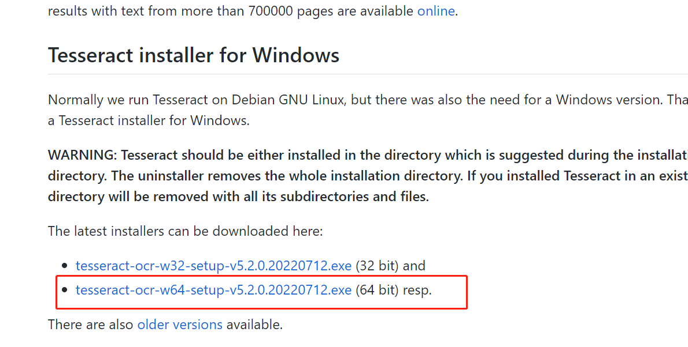
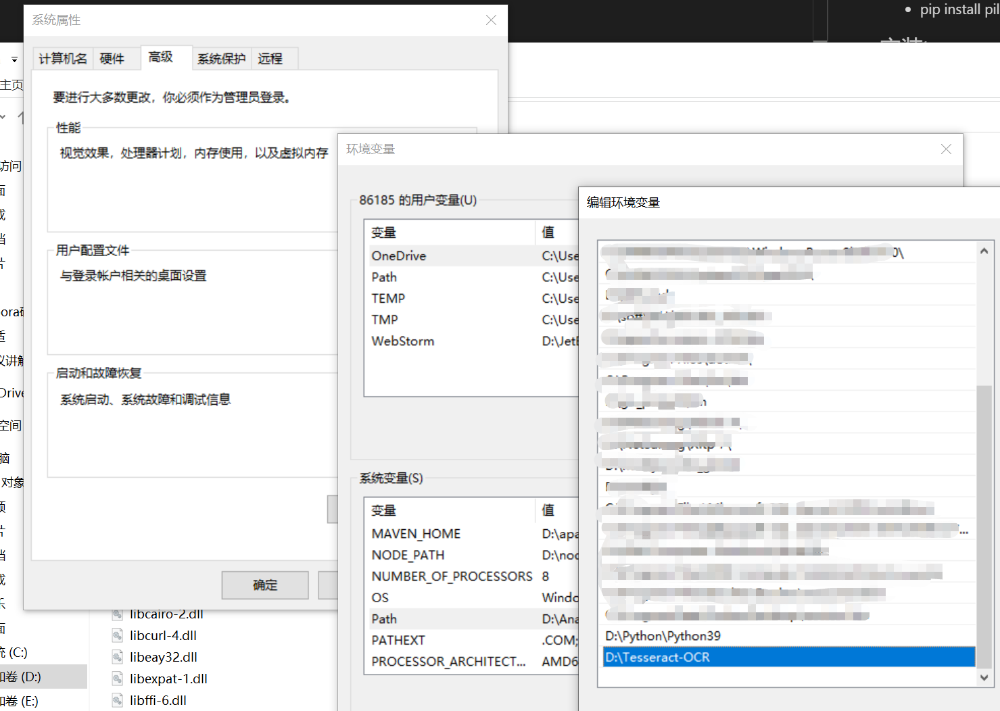
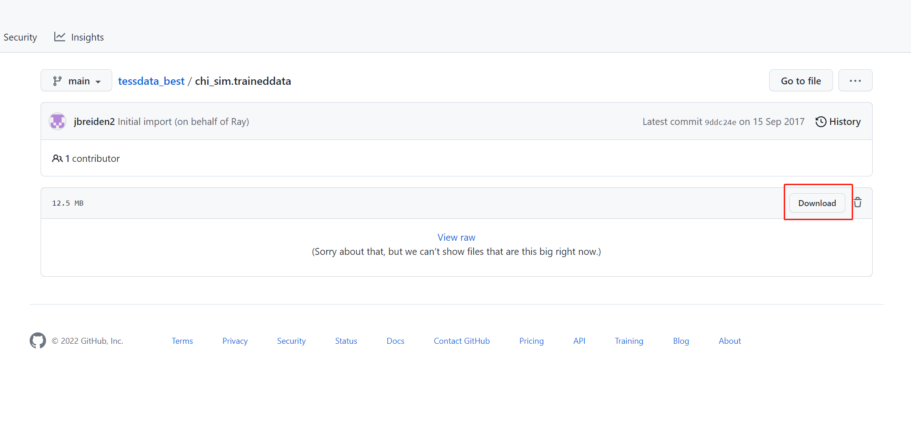

# 环境搭建
python基础环境：python=3.7
使用conda切换到python37环境下

## 安装基础依赖
 - pip install pytesseract
 - pip install pillow

 ## 安装tesseract
 1. 下载
 
 2. 配置环境变量
 > 计算机-->属性-->高级系统设置-->环境变量-->系统变量path中添加D:\Tesseract-OCR;
 

 3. 下载相关的语言包
 Tesseract默认是不支持中文的，如果想要识别中文或者其它语言需要下载相应的语言包，中文语言包为：chi_sim.traineddata
 下载地址为：https://github.com/tesseract-ocr/tessdata_best
 

 下载完成后将chi_sim.traineddata放到D:\Tesseract-OCR\tessdata目录下即可