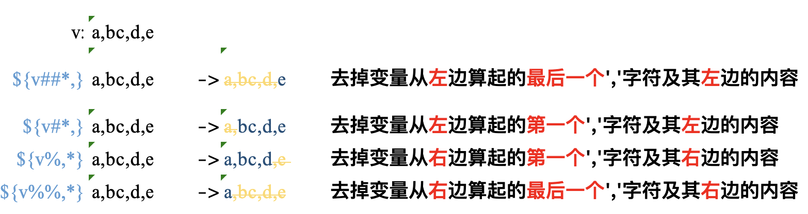

# Shell 字符串截断
> https://blog.csdn.net/G_D0120/article/details/136111945

## `##*`
- 去掉变量从左边算起的最后一个','字符及其左边的内容
- 返回从左边算起的最后一个','（不含该字符）的右边的内容 

**使用示例**
```shell
[zero@web]$ v=a,bc,d,e   
[zero@web]$ echo ${v##*,}
e
```

## `#*,`
- 去掉变量从左边算起的第一个','字符及其左边的内容
- 返回从左边算起第一个','（不含该字符）的右边部分的内容

**使用示例**

```shell
[zero@web]$ echo ${v#*,} 
bc,d,e
```

## `%,*`
- 去掉变量从右边算起的第一个','字符及其右边的内容
- 返回从右边算起的第一个'/'（不含该字符）的左边的内容

**使用示例**
```shell
[zero@web]$ echo ${v%,*}
a,bc,d
```

## `%%,*`
- 去掉变量从右边算起的最后一个','字符及其右边的内容
- 返回从右边算起的最后一个','（不含该字符）的左边的内容

**使用示例**
```shell
[zero@web]$ echo ${v%%,*}
a
```

## `${v:1}`
> 脚本的计数从1开始
- 从第一个字符截掉

**使用示例**
```shell
[zero@web]$ echo ${v:1}
,bc,d,e
```

## `${v:1,3}`
> 脚本的计数从1开始
- 从第一个到第三个截掉

**使用示例**
```shell
[zero@web]$ echo ${v:1,3}
c,d,e
```

## 总结
加下来图示一下命令的执行效果：

