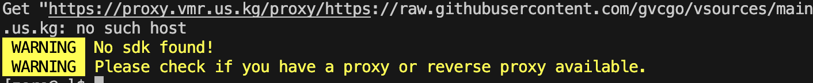

# VMR 国内配置
vmr 是一款版本管理工具，默认会请求国外元数据和基础镜像。直接启动会报一下错：



## 配置环境环境变量

通过配置改变元数据加载位置和镜像下载

配置环境变量：
```
export VMR_HOST=https://gitee.com/moqsien/vsources/raw/main
export VMR_LOCAL_PROXY=http://127.0.0.1:7890
```
不设置本地代理的话，会默认直接使用内置的`proxy.vmr.us.kg`作为代理