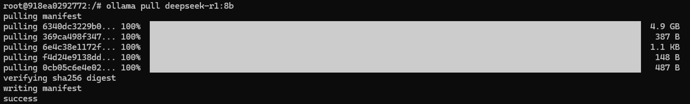
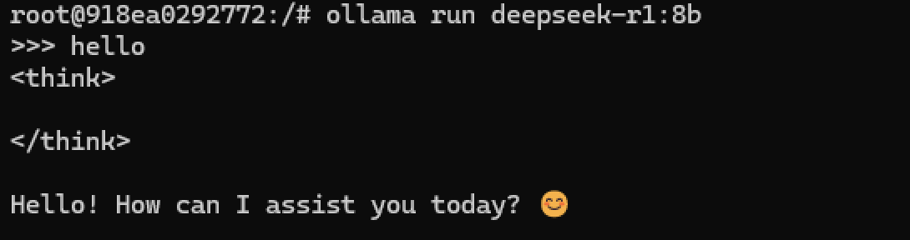
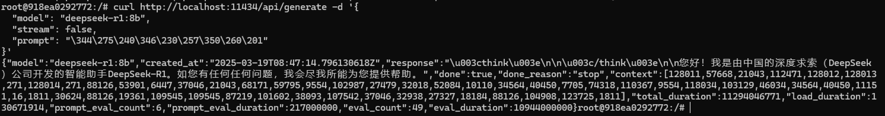
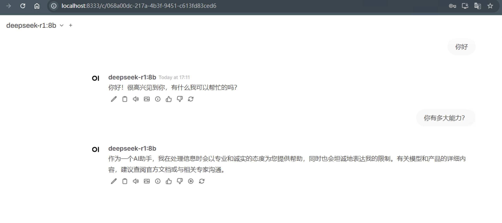

## ollama 安装
拉取镜像
```bash
docker pull ollama/ollama
```
容器启动
```bash
docker run -d -p 11434:11434 -v D:/data/ollama:/root/.ollama --name ollama ollama/ollama
```
也可以通过docker-compose 维护
```xml
services:
  ollama:
    image:ollama/ollama
    container_name:ollama
    restart:unless-stopped
    ports:
      -11434:11434
    volumes:
      -/data/ollama:/root/.ollama
    environment:
        # 允许局域网跨域形式访问API
        OLLAMA_HOST=0.0.0.0:11434
        OLLAMA_ORIGINS=*

```
进入ollama 容器
```
docker exec -it ollama /bin/bash
```

下载一个deepseek模型，根据实际需求进行模型规模下载
```bash
ollama pull deepseek-r1:8b
```
下载完成如图：



运行模型
```bash
ollama run deepseek-r1:8b
```

通过命令行验证，成功截图：



通过接口验证，成功截图


### 构建本地知识库
可以用于构建本地嵌入式的知识库
``` bash
ollama pull bge-m3
```

## 集成可视化工具
使用`open-webui`作为可视化工具，直接通过`docker-comnpose`管理可视化工具
```xml
services:
  open-webui:
    image:ghcr.io/open-webui/open-webui:main
    environment:
      -OLLAMA_API_BASE_URL=http://ollama:11434/api
      -HF_ENDPOINT=https://hf-mirror.com
      -WEBUI_NAME="Zero的LLM服务"
      # 禁用 OPENAI API 的请求。若你的网络环境无法访问 openai，请务必设置该项为 false
      # 否则在登录成功时，会因为同时请求了 openai 接口而导致白屏时间过长
      -ENABLE_OPENAI_API=false
      # 设置允许跨域请求服务的域名。* 表示允许所有域名
      -CORS_ALLOW_ORIGIN=*
      # 开启图片生成
      -ENABLE_IMAGE_GENERATION=true
      # 默认模型
      -DEFAULT_MODELS=deepseek-r1:8b
      # RAG 构建本地知识库使用的默认嵌入域名
      -RAG_EMBEDDING_MODEL=bge-m3
    ports:
      -8333:8080
    volumes:
      -D:/data/open_webui_data:/app/backend/data
    extra_hosts:
      # - host.docker.internal:host-gateway
```
启动后通过浏览器访问，效果如图：

# 参考
https://blog.csdn.net/python123456_/article/details/145747807