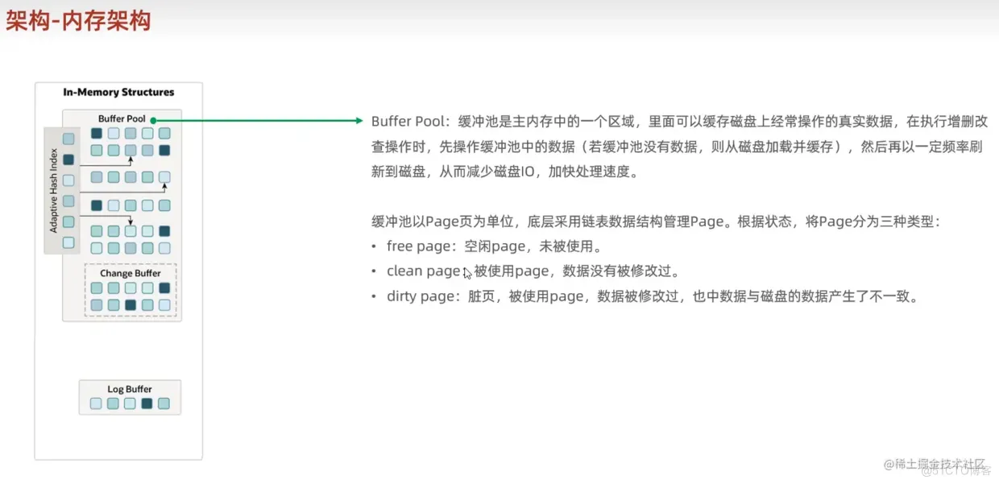

# Buffer Pool
Buffer Pool是很经典的缓存池，其中又以Page为单位

- 空闲页
- 干净页
- 脏页【类似操作系统中，修改位为1】

## 正常同步
首先我们要知道，每次事务提交后，首先是跟 Buffer pool 打交道

1. 若缓存中没有我们要操作的数据【类似缺页中断，MySQL 中数据是以页为单位】，则会启动后台线程，去磁盘中拉取过来之后就都是直接操作缓存了
2. 现在缓存的内容更新好了，但磁盘的内容还是旧的，何时更新到磁盘呢？

我们可能会有如下方案：

1. 每隔一段时间，就同步到磁盘

## 弊端

每次更新都要写入磁盘，磁盘IO很高

如果每一次的更新操作都需要写进磁盘，然后磁盘也要找到对应的那条记录，然后再更新，整个过程 IO 成本、查找成本都很高。 不如先把更新的操作，记录在redolog日志里边，之后在适当的时候，再一起刷盘！【而不是每次更新就一条一条的刷】